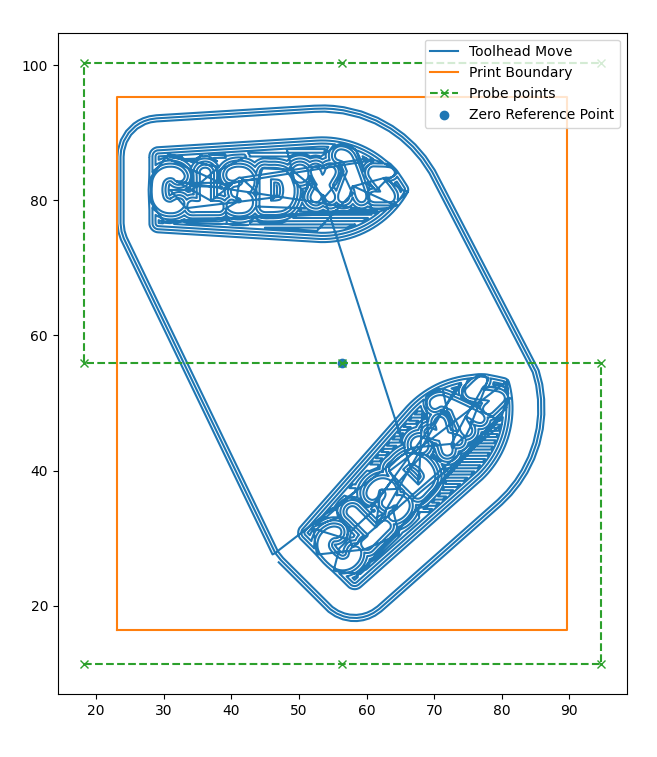

Klipper 自适应网床插件
===
[English](readme.md)

# 自适应网床是什么？
*自适应网床*插件旨在根据切片部分动态生成床面网格参数。通过在打印部件周围使用更密集的床面网格密度，
从而实现更高的探测准确性并减少探测时间。

*自适应网床*插件的灵感来源于多个开源项目：
- [Klipper mesh on print area only install guide](https://gist.github.com/ChipCE/95fdbd3c2f3a064397f9610f915f7d02)
- [Klipper Adaptive meshing & Purging](https://github.com/kyleisah/Klipper-Adaptive-Meshing-Purging)

# 支持的网床生成模式
*自适应网床*插件支持3种操作模式，并根据以下顺序在参数不足时自动切换到下一种备选算法。

1. 切片软件提供的首层最小/最大坐标。
2. 使用Klipper排除对象进行对象外框检测。
3. 使用GCode分析进行对象形状检测。

## 切片软件提供的首层最小/最大坐标
大多数切片软件可以导出首层挤出运动的最小（靠近零点坐标）和最大坐标。以下是一些常用切片软件的语法。

#### Orca Slicer / Super Slicer / Prusa Slicer

    ADAPTIVE_BED_MESH_CALIBRATE AREA_START={first_layer_print_min[0]},{first_layer_print_min[1]} AREA_END={first_layer_print_max[0]},{first_layer_print_max[1]}

#### Cura

    ADAPTIVE_BED_MESH_CALIBRATE AREA_START=%MINX%,%MINY% AREA_END=%MAXX%,%MAXY%

Cura切片需要额外的插件才能实现导出首层坐标。以下内容复制于[Klipper mesh on print area only install guide](https://gist.github.com/ChipCE/95fdbd3c2f3a064397f9610f915f7d02)

> - 在Cura菜单中选择 帮助 -> 显示配置文件夹。
> - 将上面链接中的Python脚本复制到脚本文件夹中。
> - 重新启动Cura。
> - 在Cura菜单中选择 扩展 -> 后处理 -> 修改G代码，然后选择Klipper打印区域网格。

## 使用Klipper排除对象进行边界检测
Klipper排除对象收集了已打印部件的边界用于排除对象的功能。根据切片软件的不同，已打印部件的边界可以是简单的边界框，也可以是复杂的对象几何外壳。

使用Klipper排除对象进行外形检测不需要额外的参数。如果Klipper已启用了排除对象功能，并且您的切片软件支持该功能，自适应网床则会自动启用基于排除对象的边界检测。

## 使用GCode分析进行边界检测
最后一种边界检测基于Gcode分析。当上述所有检测算法失败（或禁用）时，对象边界将由GCode分析确定。

GCode分析将评估所有挤出运动（G0、G1、G2、G3），并按层创建对象边界。在默认条件下GCode分析将解析所有打印层。如果你的Klipper配置并且开启了[网格淡化](https://www.klipper3d.org/Bed_Mesh.html#mesh-fade)，
GCode分析将在指定层数提前停止。

举个栗子，使用如下[bed_mesh]配置时，GCode分析将在距离床面10mm处停止，一同停止的还有Klipper的网床补偿功能。
    
    [bed_mesh]
    ...
    fade_start: 1
    fade_end: 10
    fade_target: 0

# 示例配置
## [bed_mesh]
*自适应网床*会从`[bed_mesh]`读取部分参数以确保运行。以下是必填属性。请确保最小/最大坐标在安全的探测边界内。

    [bed_mesh]
    # 网格的起始坐标。自适应床面网格将不会生成小于此坐标的点。
    mesh_min: 20, 20
    
    # 床面网格的最大坐标。自适应床面网格将不会生成大于此坐标的点。
    # 注意：这不一定是探针序列的最后一个点。
    mesh_max: 230, 230
    
    #（可选）GCode分析和网床补偿的最高高度
    fade_end: 10

> **_注意_** ： relative_reference_index现在已弃用。

> **_注意_** ： `zero_reference_position将会被此插件覆盖，因此您不需要在[bed_mesh]制定坐标。

## [virtual_sdcard]
*自适应网床*会从`[virtual_sdcard]`读取部分参数以确保运行。以下是必填属性。在通常情况下`[virtual_sdcard]`会由 Mainsail 或者 Fluidd 等网页前端配置文件提供。
    
    [virtual_sdcard]
    path: ~/printer_data/gcodes

## [adaptive_bed_mesh]
[adaptive_bed_mesh]需要在printer.cfg中的 `[exclude_object]` 和 `[virtual_sdcard]` 之后声明。

    [adaptive_bed_mesh]
    arc_segments: 80                     #（可选）G2/3解码为直线运动的细分数量。
    mesh_area_clearance: 5               #（可选）以毫米为单位扩展打印区域之外的网格区域。
    max_probe_horizontal_distance: 50    #（可选）水平探针点之间的最大距离（水平）（单位：毫米）。
    max_probe_vertical_distance: 50      #（可选）垂直探针点之间的最大距离（单位：毫米）。
    use_relative_reference_index: False  #（可选）对于旧版Klipper（<0.11.2xx），`use_relative_reference_index`用于确定中心点。对于新版本不需要此项。

    # (可选) 关闭特定的边界检测算法
    disable_slicer_min_max_boundary_detection: False
    disable_exclude_object_boundary_detection: False
    disable_gcode_analysis_boundary_detection: False

## 小贴士：如何确定最大水平/垂直探针距离
*自适应网床*使用探针距离而不是探测点数量来实现更一致的探测密度。

要计算最佳探针距离，可以以整个打印床的参考点数为例。对于一个250mm × 250mm的方形加热床，5x5网格通常足够。最大水平和垂直探针距离可以通过以下方式计算：

    探针间隔 = 250 / 5 = 50mm

# 使用方法
您仅需要在 `PRINT_START` 宏里调用 `ADAPTIVE_BED_MESH_CALIBREATE` 即可。

    [gcode_macro PRINT_START]
    gcode:
        ...
        ADAPTIVE_BED_MESH_CALIBRATE
        ...

> **_注意:_**  如果您正在使用 [自动Z校准插件](https://github.com/protoloft/klipper_z_calibration)
> 您则需要在调用 `CALIBRATE_Z` 之前调用 `ADAPTIVE_BED_MESH_CALIBRATE`.

# 安装（集成 Moonraker）
将代码同步到当前用户根目录。

    cd ~
    git clone https://github.com/eamars/klipper_adaptive_bed_mesh.git

第一次安装时需要执行安装脚本。

    source klipper_adaptive_bed_mesh/install.sh

同时将以下内容复制到 moonraker.conf 以开启自动更新检查。

    [update_manager client klipper_adaptive_bed_mesh]
    type: git_repo
    primary_branch: main
    path: ~/klipper_adaptive_bed_mesh
    origin: https://github.com/eamars/klipper_adaptive_bed_mesh.git
    install_script: install.sh

# 贡献代码
感谢观众姥爷贡献代码。为了保证代码的鲁棒性和正确性，在提交PR之前请确保单元测试全部通过，并在必要时添加新的测试。
